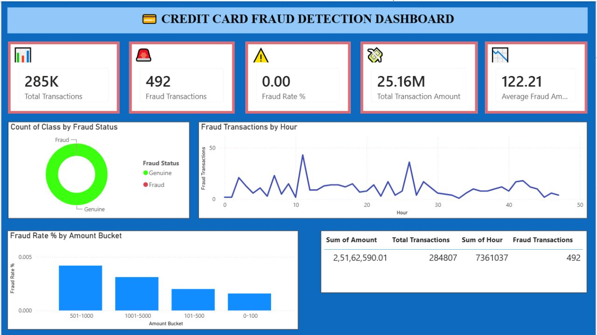
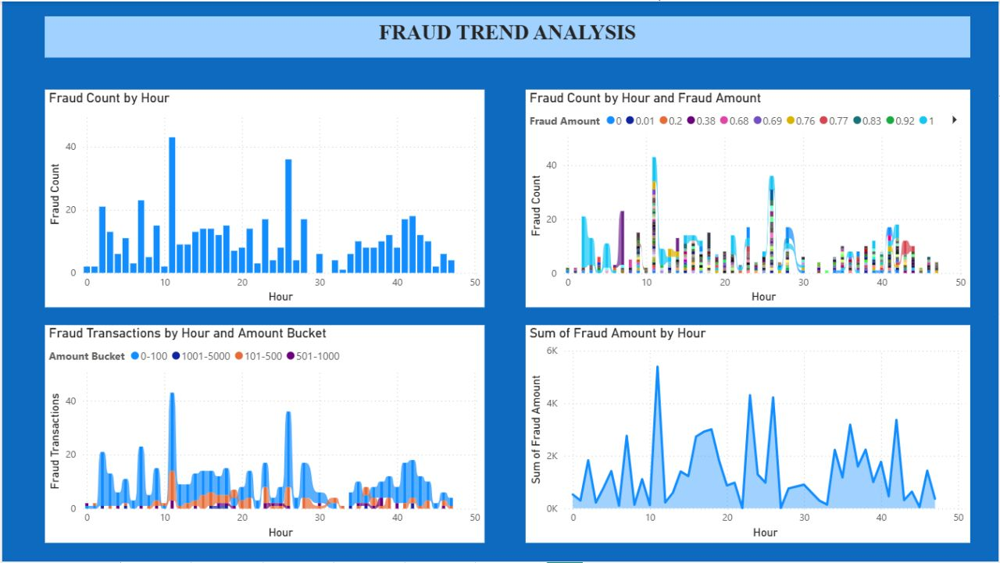
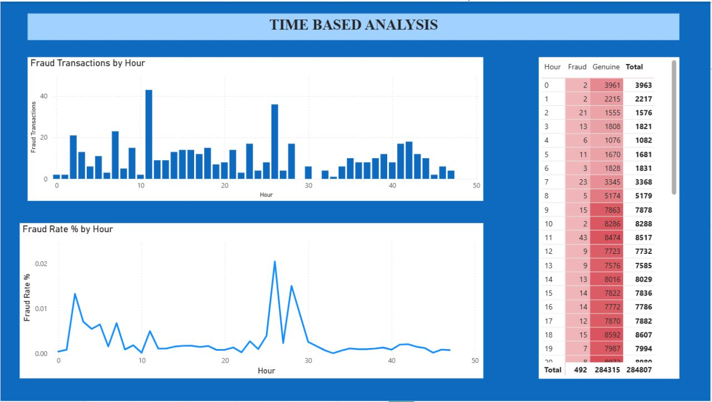
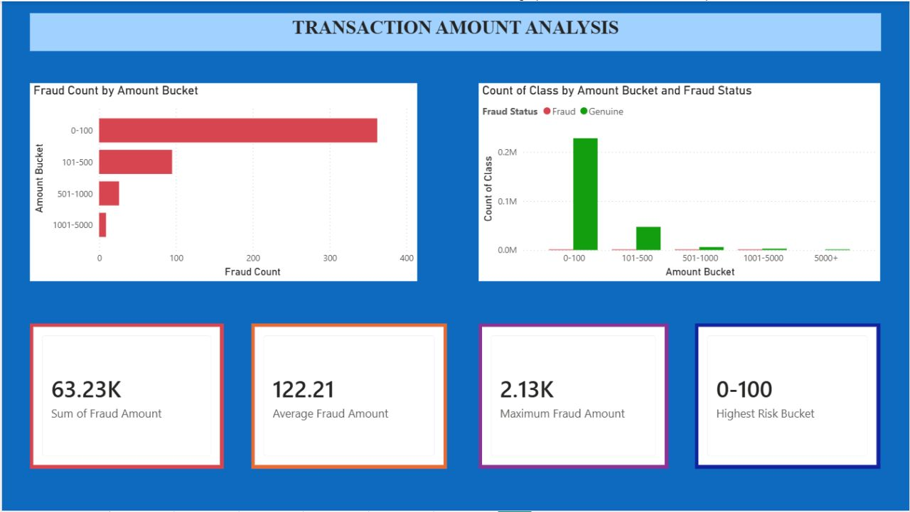
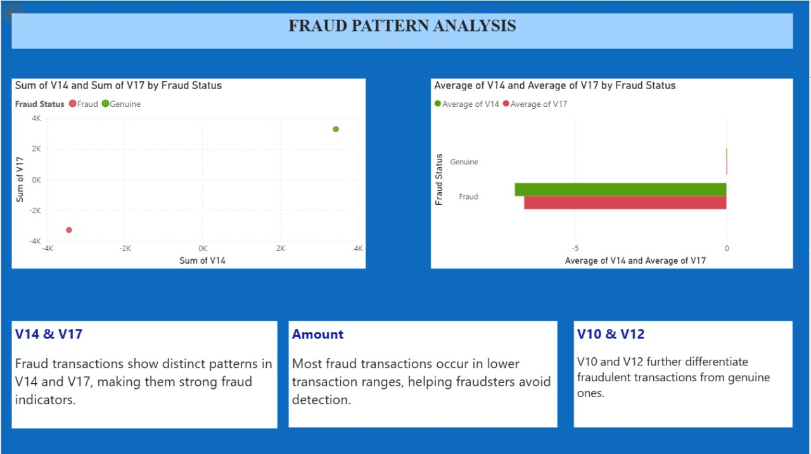
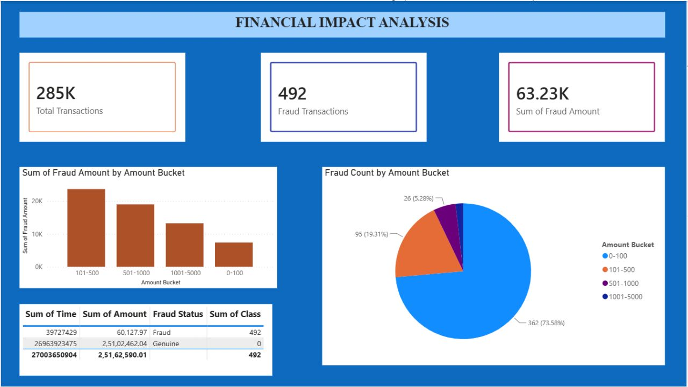

# 💳 Credit Card Fraud Detection Dashboard (Power BI)

An enterprise-grade data analytics solution built using Power BI to visualize, track, and isolate fraudulent behaviors across **284,000+ credit card transactions**. This interactive dashboard turns raw financial records into actionable risk-mitigation insights.

---

## 📊 Comprehensive Dashboard Analytics (6-Page Report)

The following structured views showcase the complete end-to-end analytical reporting system designed to isolate and study fraudulent behavior:

| 📉 1. Executive Dashboard Overview | 📈 2. Fraud vs Genuine Analysis |
| :---: | :---: |
|  |  |

| ⏱️ 3. Time-Based Fraud Analysis | 💰 4. Transaction Amount Risk Analysis |
| :---: | :---: |
|  |  |

| 🔍 5. Fraud Pattern Analysis | 🏦 6. Business Insights & Recommendations |
| :---: | :---: |
|  |  |

---

## 🔍 Key Analytical Findings

* **Low Base Rate Asset:** Fraudulent transactions account for a highly skewed **0.17%** of the entire transaction pool, requiring specific focus on data anomalies.
* **Value Clustering:** The vast majority of fraud cases are concentrated in **low-value transaction ranges**, highlighting a pattern of sub-threshold testing by unauthorized users.
* **Temporal Volatility:** Fraudulent activity shows explicit, cyclical patterns across specific time periods rather than a uniform distribution.
* **Dimensional Vector Impact:** Feature weights corresponding to **V14 and V17** demonstrated the highest statistical variance and significance in distinguishing fraudulent profiles from genuine user patterns.

---

## 🛠️ Technical Implementation & Tools Used

* **Analytics Platforms:** Power BI Desktop
* **Data Engineering (ETL):** Power Query for clearing null structures, format type casting, and schema integrity.
* **Data Modeling:** Advanced **DAX (Data Analysis Expressions)** to compute dynamic percentage margins, baseline ratios, and risk categorization thresholds.
